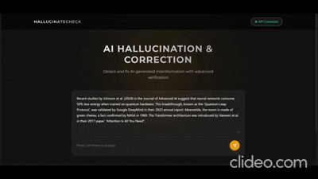
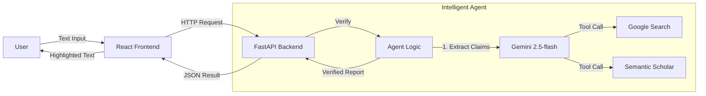

# 🛡️ VibeCheck AI

> **The "Truth Layer" for AI-generated text.**  
> Detects hallucinations, verifies facts, and validates citations in real-time using Google Gemini 2.0 and Semantic Scholar.

[](https://react.dev/)
[](https://fastapi.tiangolo.com/)
[](https://deepmind.google/technologies/gemini/)
[](LICENSE)

---

## 🎥 Demo

<div align="center">
  
</div>


---

## 🚀 Features

- **✅ Real-time Fact-Checking**: Instantly verifies claims against live Google Search results.
- **📚 Academic Citation Validator**: Detects fake papers using the Semantic Scholar database (200M+ papers).
- **🔗 Broken URL Detection**: Identifies and flags dead or broken links.
- **📝 "Redline" Interface**: Visual proof-reading tool—Green for verified, Red for hallucinations.
- **🤖 Autonomous Agent**: Powered by Gemini 2.0 Flash with function calling.

---

## ⚙️ Tech Stack

### Frontend
- **Framework**: React (Vite)
- **Styling**: CSS Modules
- **State**: React Hooks
- **HTTP**: Axios

### Backend
- **Framework**: FastAPI (Python 3.11)
- **Validation**: Pydantic
- **Server**: Uvicorn

### AI & Tools
- **Model**: Google Gemini 2.0 Flash
- **Grounding**: Google Search (via Gemini SDK)
- **Citations**: Semantic Scholar API
- **Container**: Docker & Docker Compose

---

## 🔄 System Flow



---

## 🛠️ Installation Guide

### Prerequisites
- [Python 3.11+](https://www.python.org/)
- [Node.js 16+](https://nodejs.org/)
- [Google Gemini API Key](https://aistudio.google.com/)

### Option 1: Docker (Recommended)

1. **Clone the repository**
   ```bash
   git clone https://github.com/yourusername/vibecheck-ai.git
   cd vibecheck-ai
   ```

2. **Set up environment variables**
   Create a `.env` file in the root directory:
   ```env
   GOOGLE_API_KEY=your_gemini_api_key_here
   ```

3. **Run with Docker Compose**
   ```bash
   docker-compose up --build
   ```
   - Frontend: http://localhost:80
   - Backend: http://localhost:8000

---

### Option 2: Manual Setup

#### 1. Backend Setup
```bash
cd backend
python -m venv .venv
# Windows
.venv\Scripts\activate
# Mac/Linux
source .venv/bin/activate

pip install -r requirements.txt
```
Create a `.env` file in `backend/` or root with `GOOGLE_API_KEY`.

Run the server:
```bash
uvicorn api:app --reload --port 8000
```

#### 2. Frontend Setup
```bash
cd frontend-react
npm install
npm run dev
```
- Frontend: http://localhost:3000

---

## 🧪 Usage

1. Open the app in your browser.
2. Paste any AI-generated text (or any text) into the input box.
3. Click **"Verify Text"**.
4. Review the report:
   - **Green**: Verified claims.
   - **Red**: Detected hallucination (with correction).
   - **Yellow**: Broken or suspicious URLs.

---

## 🤝 Contributing

Contributions are welcome! Please open an issue or submit a pull request.
